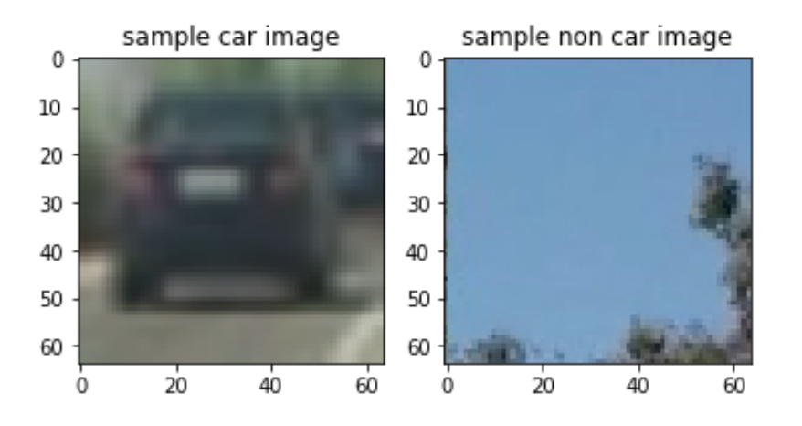
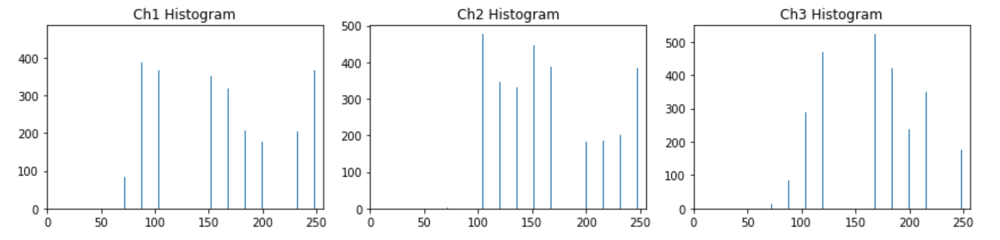
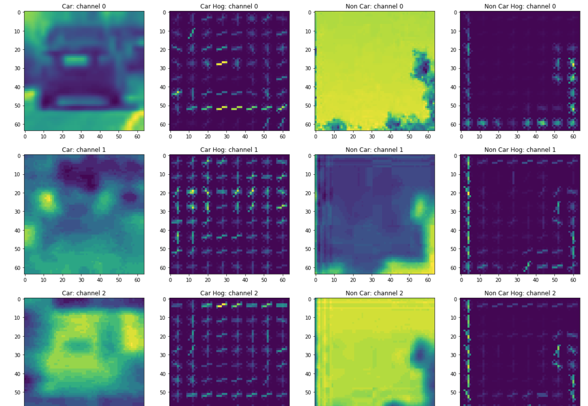
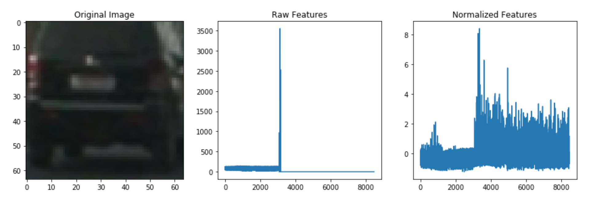

# Vehicle Detection Project

The goals / steps of this project are the following:

* Perform a Histogram of Oriented Gradients (HOG) feature extraction on a labeled training set of images and train a classifier Linear SVM classifier
* Optionally, you can also apply a color transform and append binned color features, as well as histograms of color, to your HOG feature vector. 
* Note: for those first two steps don't forget to normalize your features and randomize a selection for training and testing.
* Implement a sliding-window technique and use your trained classifier to search for vehicles in images.
* Run your pipeline on a video stream (start with the test_video.mp4 and later implement on full project_video.mp4) and create a heat map of recurring detections frame by frame to reject outliers and follow detected vehicles.
* Estimate a bounding box for vehicles detected.


[Rubric](https://review.udacity.com/#!/rubrics/513/view) Points 

---
## Dataset Exploration
The datasets we use are comprised of images taken from the GTI vehicle image database, the KITTI vision benchmark suite, and examples extracted from the project video itself. The statistics of datasets are shown as below. 

|               | Training      | Test          |
|:-------------:|:-------------:|:-------------:|
| Car           | 5890          | 2902          | 
| Non Car       | 6008          | 2960          |
| Total         | 11898         | 5862          |

We show two example images in Figure 1.
<p align="center">
  
  <br>
  <em>Figure 1: Example Images</em>
</p>


## Features

### Color Spatial
Raw pixel values are still quite useful to include in feature vector in searching for cars. It could be cumbersome to include three color channels of a full resolution image. So we performed spatial binning on images and still retain enough information to help in finding vehicles. The ```bin_spatial``` function is defined as below:

```python
def bin_spatial(img, size=(32, 32)):
    # Use cv2.resize().ravel() to create the feature vector
    features = cv2.resize(img, size).ravel()
    # Return the feature vector
    return features
```
### Color Histogram
Besides color spatial, we also include color histogram as training feature. This feature can be extracted using the following function. 

```python
def color_hist(img, nbins = 32, bins_range = (0, 256), visualise = False):
    ch1_hist = np.histogram(img[:,:,0], nbins, bins_range)
    ch2_hist = np.histogram(img[:,:,1], nbins, bins_range)
    ch3_hist = np.histogram(img[:,:,2], nbins, bins_range)
    
    bin_centers = (ch1_hist[1][0:-1] + ch1_hist[1][1:])
    hist_features = np.concatenate((ch1_hist[0], ch2_hist[0], ch3_hist[0]))
    
    if visualise:
        return ch1_hist, ch2_hist, ch3_hist, bin_centers, hist_features
    else:
        return hist_features
```

<p align="center">
  
  <br>
  <em>Figure 2: Color Histogram</em>
</p>

### Histogram of Oriented Gradients (HOG)


To extract hog features, we firstly convert images to ```YCrCb``` color space. The difference between YCbCr and RGB is that YCbCr represents color as brightness and two color difference signals. In YCbCr, the Y is the brightness (luma), Cb is blue minus luma (B-Y) and Cr is red minus luma (R-Y). Looking at Figure 3, YCbCr does a pretty good job in showing shapes and edges, which is a solid foundation for hog feature extraction.

Then we will use ```skimage.feature.hog``` function to extract hog feature for each channel. The parameters we used are in the table below.

| Hog Parameter | Value      |
|:-------------:|:----------:|
| orientations   | 9         |
| pixels_per_cell| 8         |
| cell_per_block | 2         | 
```python
def get_hog_features(img, orient, pix_per_cell, cell_per_block, vis=False, feature_vec=True):
    if vis == True:
        # Use skimage.hog() to get both features and a visualization
        features, hog_image = hog(
                            img, 
                            orientations=orient,
                            pixels_per_cell=(pix_per_cell, pix_per_cell), 
                            cells_per_block=(cell_per_block, cell_per_block), 
                            visualise=True, 
                            feature_vector=feature_vec,
                            transform_sqrt = False)
        return features, hog_image
    else:      
        # Use skimage.hog() to get features only
        features = hog(
                img, 
                orientations=orient,
                pixels_per_cell=(pix_per_cell, pix_per_cell), 
                cells_per_block=(cell_per_block, cell_per_block), 
                visualise=False, 
                feature_vector=feature_vec,
                transform_sqrt = False)
        return features
```

The hog features for car image and non car image are shown in Figure 3.
<p align="center">
  
  <br>
  <em>Figure 3: YCrCb Hog</em>
</p>


## Training Classifier

To train a vehicle classifier, we used linear SVM and concatenate all the color spatial, color histogram and hog features. The length of feature vector is **8460**. Then the feature vector will be normalized by ```sklearn.preprocessing.StandardScaler```. We show one normalized example below.

<p align="center">
  
  <br>
  <em>Figure 4: Feature Normalization</em>
</p>

We used ```sklearn.model_selection.GridSearchCV``` to tune the model and got ```training accuracy = 1.0``` and ```test accuracty = 0.9922```. 

## Sliding Window

## False Positive Prevention

## Process Video


#### 1. Explain how (and identify where in your code) you extracted HOG features from the training images.

The code for this step is contained in the first code cell of the IPython notebook (or in lines # through # of the file called `some_file.py`).  

I started by reading in all the `vehicle` and `non-vehicle` images.  Here is an example of one of each of the `vehicle` and `non-vehicle` classes:

![alt text][image1]

I then explored different color spaces and different `skimage.hog()` parameters (`orientations`, `pixels_per_cell`, and `cells_per_block`).  I grabbed random images from each of the two classes and displayed them to get a feel for what the `skimage.hog()` output looks like.

Here is an example using the `YCrCb` color space and HOG parameters of `orientations=8`, `pixels_per_cell=(8, 8)` and `cells_per_block=(2, 2)`:


![alt text][image2]

#### 2. Explain how you settled on your final choice of HOG parameters.

I tried various combinations of parameters and...

#### 3. Describe how (and identify where in your code) you trained a classifier using your selected HOG features (and color features if you used them).

I trained a linear SVM using...

### Sliding Window Search

#### 1. Describe how (and identify where in your code) you implemented a sliding window search.  How did you decide what scales to search and how much to overlap windows?

I decided to search random window positions at random scales all over the image and came up with this (ok just kidding I didn't actually ;):

![alt text][image3]

#### 2. Show some examples of test images to demonstrate how your pipeline is working.  What did you do to optimize the performance of your classifier?

Ultimately I searched on two scales using YCrCb 3-channel HOG features plus spatially binned color and histograms of color in the feature vector, which provided a nice result.  Here are some example images:

![alt text][image4]
---

### Video Implementation

#### 1. Provide a link to your final video output.  Your pipeline should perform reasonably well on the entire project video (somewhat wobbly or unstable bounding boxes are ok as long as you are identifying the vehicles most of the time with minimal false positives.)
Here's a [link to my video result](./project_video.mp4)


#### 2. Describe how (and identify where in your code) you implemented some kind of filter for false positives and some method for combining overlapping bounding boxes.

I recorded the positions of positive detections in each frame of the video.  From the positive detections I created a heatmap and then thresholded that map to identify vehicle positions.  I then used `scipy.ndimage.measurements.label()` to identify individual blobs in the heatmap.  I then assumed each blob corresponded to a vehicle.  I constructed bounding boxes to cover the area of each blob detected.  

Here's an example result showing the heatmap from a series of frames of video, the result of `scipy.ndimage.measurements.label()` and the bounding boxes then overlaid on the last frame of video:

### Here are six frames and their corresponding heatmaps:

![alt text][image5]

### Here is the output of `scipy.ndimage.measurements.label()` on the integrated heatmap from all six frames:
![alt text][image6]

### Here the resulting bounding boxes are drawn onto the last frame in the series:
![alt text][image7]


---

### Discussion

#### 1. Briefly discuss any problems / issues you faced in your implementation of this project.  Where will your pipeline likely fail?  What could you do to make it more robust?

Here I'll talk about the approach I took, what techniques I used, what worked and why, where the pipeline might fail and how I might improve it if I were going to pursue this project further.  

