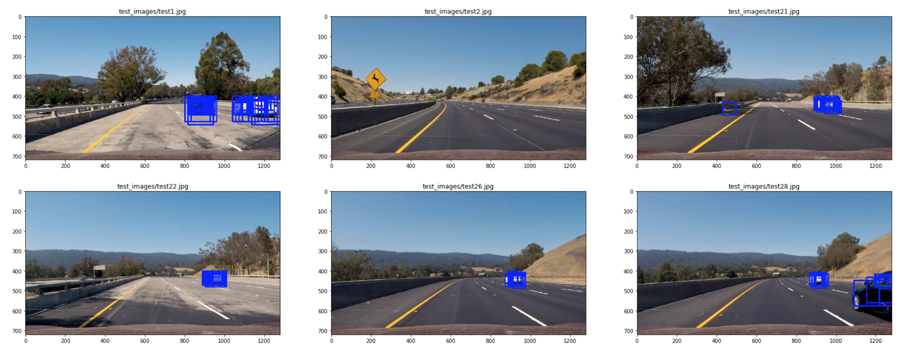
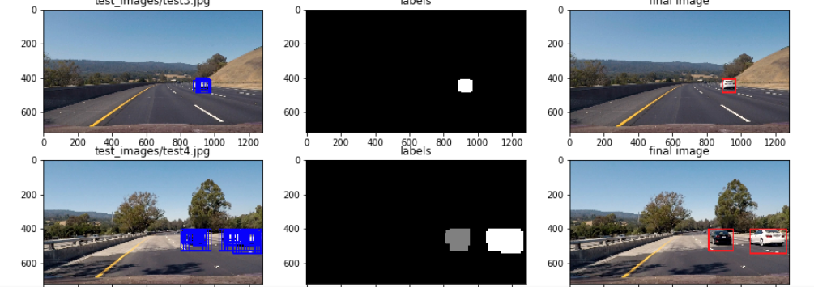

# Vehicle Detection Project

The goals / steps of this project are the following:

* Perform a Histogram of Oriented Gradients (HOG) feature extraction on a labeled training set of images and train a classifier Linear SVM classifier
* Optionally, you can also apply a color transform and append binned color features, as well as histograms of color, to your HOG feature vector. 
* Note: for those first two steps don't forget to normalize your features and randomize a selection for training and testing.
* Implement a sliding-window technique and use your trained classifier to search for vehicles in images.
* Run your pipeline on a video stream (start with the test_video.mp4 and later implement on full project_video.mp4) and create a heat map of recurring detections frame by frame to reject outliers and follow detected vehicles.
* Estimate a bounding box for vehicles detected.


[Rubric](https://review.udacity.com/#!/rubrics/513/view) Points 

---
## Dataset Exploration
The datasets we use are comprised of images taken from the GTI vehicle image database, the KITTI vision benchmark suite, and examples extracted from the project video itself. The statistics of datasets are shown as below. 

|               | Training      | Test          |
|:-------------:|:-------------:|:-------------:|
| Car           | 5890          | 2902          | 
| Non Car       | 6008          | 2960          |
| Total         | 11898         | 5862          |

We show two example images in Figure 1.
<p align="center">
  
  <br>
  <em>Figure 1: Example Images</em>
</p>


## Features

### Color Spatial
Raw pixel values are still quite useful to include in feature vector in searching for cars. It could be cumbersome to include three color channels of a full resolution image. So we performed spatial binning on images and still retain enough information to help in finding vehicles. The ```bin_spatial``` function is defined as below:

```python
def bin_spatial(img, size=(32, 32)):
    # Use cv2.resize().ravel() to create the feature vector
    features = cv2.resize(img, size).ravel()
    # Return the feature vector
    return features
```
### Color Histogram
Besides color spatial, we also include color histogram as training feature. This feature can be extracted using the following function. 

```python
def color_hist(img, nbins = 32, bins_range = (0, 256), visualise = False):
    ch1_hist = np.histogram(img[:,:,0], nbins, bins_range)
    ch2_hist = np.histogram(img[:,:,1], nbins, bins_range)
    ch3_hist = np.histogram(img[:,:,2], nbins, bins_range)
    
    bin_centers = (ch1_hist[1][0:-1] + ch1_hist[1][1:])
    hist_features = np.concatenate((ch1_hist[0], ch2_hist[0], ch3_hist[0]))
    
    if visualise:
        return ch1_hist, ch2_hist, ch3_hist, bin_centers, hist_features
    else:
        return hist_features
```

<p align="center">
  
  <br>
  <em>Figure 2: Color Histogram</em>
</p>

### Histogram of Oriented Gradients (HOG)


To extract hog features, we firstly convert images to ```YCrCb``` color space. The difference between YCbCr and RGB is that YCbCr represents color as brightness and two color difference signals. In YCbCr, the Y is the brightness (luma), Cb is blue minus luma (B-Y) and Cr is red minus luma (R-Y). Looking at Figure 3, YCbCr does a pretty good job in showing shapes and edges, which is a solid foundation for hog feature extraction.

Then we will use ```skimage.feature.hog``` function to extract hog feature for each channel. The parameters we used are in the table below.

| Hog Parameter | Value      |
|:-------------:|:----------:|
| orientations   | 9         |
| pixels_per_cell| 8         |
| cell_per_block | 2         | 
```python
def get_hog_features(img, orient, pix_per_cell, cell_per_block, vis=False, feature_vec=True):
    if vis == True:
        # Use skimage.hog() to get both features and a visualization
        features, hog_image = hog(
                            img, 
                            orientations=orient,
                            pixels_per_cell=(pix_per_cell, pix_per_cell), 
                            cells_per_block=(cell_per_block, cell_per_block), 
                            visualise=True, 
                            feature_vector=feature_vec,
                            transform_sqrt = False)
        return features, hog_image
    else:      
        # Use skimage.hog() to get features only
        features = hog(
                img, 
                orientations=orient,
                pixels_per_cell=(pix_per_cell, pix_per_cell), 
                cells_per_block=(cell_per_block, cell_per_block), 
                visualise=False, 
                feature_vector=feature_vec,
                transform_sqrt = False)
        return features
```

The hog features for car image and non car image are shown in Figure 3.
<p align="center">
  
  <br>
  <em>Figure 3: YCrCb Hog</em>
</p>


## Training Classifier

To train a vehicle classifier, we used linear SVM and concatenate all the color spatial, color histogram and hog features. The length of feature vector is **8460**. Then the feature vector will be normalized by ```sklearn.preprocessing.StandardScaler```. We show one normalized example below.

<p align="center">
  
  <br>
  <em>Figure 4: Feature Normalization</em>
</p>

We used ```sklearn.model_selection.GridSearchCV``` to tune the model and got ```training accuracy = 1.0``` and ```test accuracty = 0.9922```. 

## Sliding Window

The sliding window algorithm we used is very straightforward. We calcuate the number of steps in x and y axis. Then by multiplying ```cells_per_step```, we can get top left corner of the window. To speed up hog feature extraction, we pre-compute hog features for interested region and fetch them by the window region.

We used different sliding window scales for different regions in a image. We used scale = 1 for y in ```[400, 500]``` to detecting further cars and sacle = 2 for y in ```[400, 656]``` to detecting closer cars. Some examples after sliding window detection are shown in Figure 5.

<p align="center">
  
  <br>
  <em>Figure 5: Sliding Window Dection</em>
</p>


## False Positive Prevention

Although we have SVM classifier with more than 99% accuracy, we will have hundreds sliding windows for a single image, in which case a lots of false positives will be generated for video processing. To overcome this, we will use heatmap to count how many windows are detected on a given region and then apply a threshold to filter out some detected region with lower heat.
```scipy.ndimage.measurements.label``` function will be used to get connected components of the heatmap and a final bounding box will be drawn around those components. Some examples are shown in Figure 6.

<p align="center">
  
  <br>
  <em>Figure 6: Processing Pipeline with Heatmap</em>
</p>


## Process Video

The processed video can be found [here](https://github.com/XQ-UT/CarND-Vehicle-Detection/blob/master/output_video/project_video.mp4).

During the video processing, we still found a lot of false positives and bounding boxes were jittering. To smooth the jitter and reduce false positives, we used a queue with size 10 to store the previous 10 frames' bounding boxes. Then we applied higher threshold to filter false positive and averaged the drawn bounding boxes. The processing function was defined as below.

```python
bboxes_queue = []
bboxes_queue_capacity = 10
false_positive_threshold = 20

def detect_cars_for_video_frame(video_img):    
    bboxes_small = find_cars_bboxes(video_img, 
                              ystart = 400, ystop = 500, scale = 1, cells_per_step = 1,
                              svc = svm_clf, X_scaler = X_scaler,
                              orient = 9, pix_per_cell = 8, cell_per_block = 2,
                              spatial_size = (32, 32),
                              hist_bins = 32
                             )
    bboxes_large = find_cars_bboxes(video_img, 
                          ystart = 400, ystop = 656, scale = 2, cells_per_step = 1,
                          svc = svm_clf, X_scaler = X_scaler,
                          orient = 9, pix_per_cell = 8, cell_per_block = 2,
                          spatial_size = (32, 32),
                          hist_bins = 32
                         )
    single_frame_bboxes = bboxes_small + bboxes_large
    
    if len(bboxes_queue) == bboxes_queue_capacity:
        bboxes_queue.pop(0)
    bboxes_queue.append(single_frame_bboxes)
    bboxes_accumulated = [bbox for bboxes in bboxes_queue for bbox in bboxes]
    
    heatmap = get_heatmap(video_img, bboxes_accumulated)
    heatmap = apply_threshold(heatmap, false_positive_threshold)
    labels = label(heatmap)
    result_img = draw_labeled_bboxes(video_img, labels)
    
    return result_img
```
## Discussion

When we first implemented the classifier, we used RGB color space and only gray hog feature. The classifer only achieved 97% accuracy. So we had a lot of false positives, as shown in Figure 7. Then we used ```YCrCb``` color space and extracted hog features from all the three channels. Then the model accuracy was improved to 99.28%.

<p align="center">
  
  <br>
  <em>Figure 7: False Positive Example</em>
</p>

One limitation of this pipeline is that it may not be able to detect 2 cars when the 2 cars overlapped in the image. Also, different light conditions may affect the model accuracy and cause false positives.


